  

  

I work at the intersection of growth, AI and software. My background is in SEO 
and digital growth — from technical audits and content systems to international 
client work. Today I'm focused on building automation, AI-powered workflows and 
products that make growth work faster and more effective.

  

## What I work on

- AI and automation systems connecting LLMs, APIs and business workflows
- Technical SEO, search systems and SEO automation
- Products built and shipped end-to-end
- Currently building **AIRA**, an AI career platform for students

  

## How I got here

  

I started on this account in 2022 building React SPAs as a student, spent the
next couple of years working across commercial SEO and web projects, and now
focus on the automation, AI and product systems behind modern growth. The early
projects are still public below — the trajectory matters more than pretending it
started polished.

I'm currently studying Business Informatics at the Financial University in
Moscow, where AIRA is part of the university's Business Incubator program.

  

## Selected projects

<table>
<tr>
<td width="50%" valign="top">

### [AIRA →](https://student-aira.com)

AI career platform for students, combining job discovery, matching, application
workflows and personalized career assistance.

Started it because students are the group with the least leverage in hiring and
the least time to spend on it.

`Live product` · `source not public yet`

</td>
<td width="50%" valign="top">

### [ai-wordpress-publisher →](https://github.com/Takeshhii/ai-wordpress-publisher)

LLM content pipeline that turns keyword briefs into SEO articles and publishes
them to WordPress on a controlled schedule.

Built to keep several content properties running without a content team.
Currently powers automated content workflows for AIRA and an NFC products
business from a shared configuration.

`Python` · `LLM APIs` · `WordPress REST API`

</td>
</tr>
<tr>
<td width="50%" valign="top">

### [bottle-label-studio →](https://github.com/Takeshhii/bottle-label-studio)

Browser tool for compositing product labels onto bottle photos with
perspective-aware warping and realistic shading.

Turns a label design into a usable product image in seconds, reducing manual
mockup work per design variant.

`React` · `TypeScript` · `PixiJS`

</td>
<td width="50%" valign="top">

### [nfc-msk-theme →](https://github.com/Takeshhii/nfc-msk-theme)

Custom WordPress theme with built-in technical SEO infrastructure, including
redirect management and indexing controls, for an NFC products business I run.

Replaced a purchased theme that made search-level control harder than it needed
to be.

`PHP` · `WordPress` · `technical SEO`

</td>
</tr>
<tr>
<td width="50%" valign="top">

### [Conversion Collective →](https://convertcollective.com)

Live site for a B2B revenue and sales-systems consultancy, structured around a
single primary acquisition and booking flow.
[Source](https://github.com/Takeshhii/conversion-collective)

`HTML/CSS/JS` · `analytics`

</td>
<td width="50%" valign="top">

### [ZHIVA →](https://zhivajewelry.com)

Live Shopify jewelry business where I work on organic growth, SEO architecture
and content across products and collections.

`Shopify` · `SEO` · `growth`

</td>
</tr>
<tr>
<td width="50%" valign="top">

### [ШЛЮЗ →](https://github.com/Takeshhii/shlyuz)

Browser horror game about checking documents at an airlock 340 meters down.
Six shifts, four endings, all audio synthesized live at runtime.

Built solo as a break from client work — same discipline of shipping a
complete system, applied to something with no deadline but my own.

`TypeScript` · `Vite` · `Web Audio API`

</td>
<td width="50%" valign="top"></td>
</tr>
</table>

**Earlier work (2023, archived):**
[bike-theft-tracker](https://github.com/Takeshhii/bike-theft-tracker) — React SPA
with JWT auth, role-based access and REST API integration ·
[kanban-board](https://github.com/Takeshhii/kanban-board) — React task board with
per-task routing and local persistence.

  

## Stack

  

  

  

  &nbsp;
  &nbsp;
  

