  

  

I work at the intersection of growth, AI and software. My background is in SEO 
and digital growth — technical audits, content systems, work with clients 
including in the US — and I've been moving into building the automation and 
AI systems that growth work increasingly runs on.

 

## What I work on

- Automation systems that connect LLMs, APIs and content/publishing workflows
- Technical SEO and SEO automation
- Small products built and shipped end-to-end, not just prototyped
- Currently building **AIRA**, an AI career-assistant product for students

## Selected projects

- **[AIRA](https://my-student-aira.com)** — AI career-assistant product for students I'm building: a job-search dashboard with HH.ru integration, saved vacancies and application notes. Live product; source isn't public yet.
- **[ai-wordpress-publisher](https://github.com/Takeshhii/ai-wordpress-publisher)** — LLM content pipeline that generates and auto-publishes SEO articles to WordPress on a controlled schedule. Runs the content side of AIRA and an NFC-products business off one config.
- **[bottle-label-studio](https://github.com/Takeshhii/bottle-label-studio)** — Browser tool that composites product labels onto bottle photos with physically-based warp and shading, replacing manual reshoots.
- **[nfc-msk-theme](https://github.com/Takeshhii/nfc-msk-theme)** — Custom WordPress theme with technical SEO infrastructure built in (redirects, indexation control) for a business I run.
- **[conversion-collective](https://github.com/Takeshhii/conversion-collective)** — Conversion-focused site built for a B2B sales-consulting business.
- **[ZHIVA](https://zhivajewelry.com)** — Live Shopify jewelry store; I handle SEO and content — product/collection copy, structured content, on-page optimization.

## Stack

  

Python · TypeScript / JavaScript · React · Next.js · WordPress / PHP · LLM APIs · workflow automation

## Links

  
  
  

